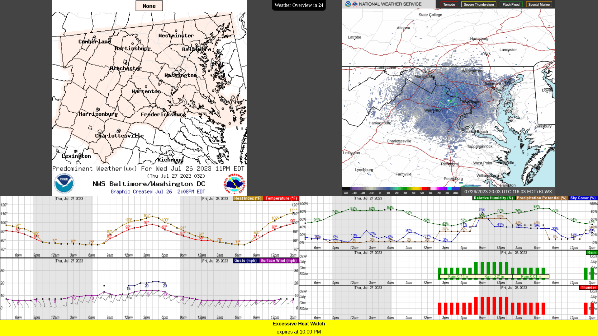

# Weather Monitor

During the spring and summer, Stafford (usually) gets some pretty severe thunderstorms. To keep everyone in the house up-to-date on the weather, this television displays several slides containing weather information from [WJLA] and the [National Weather Service].

[WJLA]: https://wjla.com/
[National Weather Service]: https://weather.gov

The screen is controlled by a [Raspberry Pi 3B+ v1.3][Pi 3B+] powered from the wall and hiding behind the TV. When the desktop session starts, a Chrome Kiosk starts, pointed to a web app written in Vue which fetches and updates images over the internet. The images currently come from the NWS[^1] and the [WJLA Weather Maps].

[Pi 3B+]: https://www.raspberrypi.com/products//raspberry-pi-3-model-b-plus/
[WJLA Weather Maps]: https://wjla.com/weather/maps
[^1]: From multiple sources. There's a page for generating [forecast graphs][NWS Plotter] and [graphical forecasts][NDFDB]

## Web App

The heart of the monitor, Vue's reactivity system keeps everything up-to-date. The page keeps two timers, a 10 minute timer for fetching all the weather information, and a 30 second timer that advances through the images. Everything else is calculated from the state of these timers.

Some things the app shows:
- Hourly forecast from the NWS
- Predominant weather forecast for the local area
- Live radar for the local area (and a nicer-looking copy from WJLA).
- Wind, gusts, temperature and heat index for the surrounding area.
- Warnings in the local area.
- Active warnings from the [NWS Alert API] that appear on the bottom.

[NWS Alert API]: https://www.weather.gov/documentation/services-web-api#/default/alerts_active

## Limitations

Chrome is resource-heavy, and the Pi 3B+ is just powerful enough to run the app. If the page is heavy the Pi will struggle to show the entire page, or have weird visual artifacts.

The whole monitor has to be turned on and off manually every morning and every night. Getting the system shutting down at a specified time is probably trivial, but waking it up in the morning is seemingly impossible. The Pi can suspend, but from what I can gather online, without an external timer attached to the Pi, you can't wake it up back up.

## Next Steps

Next on this project is to get it turning off and on automatically. I think systemd might be useful here because units/timers can wake the system up.
Some other things, like putting more than just a weather monitor on this screen could happen too.

[NWS Plotter]: https://forecast.weather.gov/MapClick.php?lat=38.4068&lon=-77.3968&unit=0&lg=english&FcstType=graphical
[NDFDB]: https://graphical.weather.gov/sectors/nemetro.php?element=MaxT
